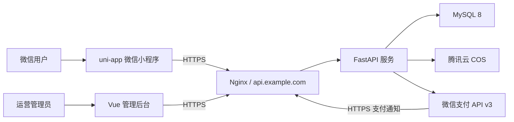
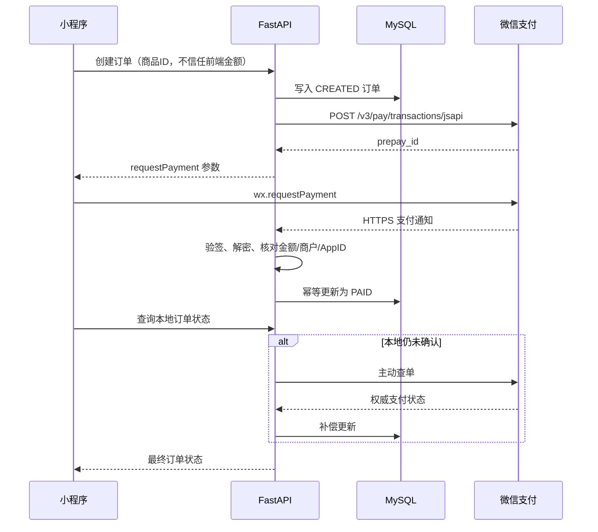

# 微信小程序抽奖商城开发指南

> 文档状态：规划版（尚未开始编码）  
> 编制日期：2026-08-15  
> 需求来源：`doc/需求.txt`  
> 核心原则：整体分三个阶段实施；第一阶段先验证“能部署、能支付、能查错、能退款”，再扩展完整业务。

## 1. 需求分析与结论

### 1.1 原始需求整理

根据 `需求.txt`，系统需要实现：

1. 用户支付 1 元或 5 元后获得一次抽奖资格；
2. 后台可以新增、上传和更新奖品；
3. 中奖用户填写收货地址，管理员按地址发货；
4. 未中奖用户获得积分，积分可在商城兑换或购买商品；
5. 小程序使用 uni-app，后端使用 Python，部署在腾讯云；
6. 最终按商业项目标准发布。

系统实际上包含四条业务链路：

- 交易链路：创建订单 → 微信支付 → 支付回调 → 查单/退款；
- 抽奖链路：获得资格 → 服务端抽奖 → 扣减库存 → 记录结果；
- 权益链路：未中奖发积分 → 积分流水 → 商城兑换；
- 履约链路：中奖 → 保存收货地址快照 → 后台发货 → 填写快递单号。

### 1.2 必须先处理的商业合规风险

“直接支付 1 元或 5 元购买随机中奖机会”不是普通电商支付场景，可能触及微信平台对抽奖、赌博、一元购和付费随机玩法的限制，也可能涉及经营资质和地区法律要求。**在获得平台/法务的书面确认前，不应把真实支付与随机抽奖正式绑定上线。**

第一阶段仍然验证微信支付，但验证对象应当是隔离的“测试商品/明确交付的商品订单”，测试完成后原路退款；抽奖资格先用后台测试资格或模拟支付发放。只有完成以下 Go/No-Go 检查，第二阶段才把二者接通：

- 小程序服务类目允许该业务；
- 微信支付商户审核明确接受实际售卖内容和交易模式；
- 经营主体、奖品、概率公示、退款规则、发货承诺和用户协议经过合规审查；
- 如该模式不获批准，改为“免费抽奖 + 商品正常销售”，或“购买确定商品/权益，抽奖仅作为合规营销活动”，不得通过积分等方式变相恢复付费抽奖。

微信支付官方接入说明指出：未认证的小程序不能申请小程序支付；商户号需开通相应权限并绑定 AppID；交易类小程序还需遵守交易类运营规范和接入订单发货管理。参见[小程序支付开发接入准备](https://pay.wechatpay.cn/doc/v3/merchant/4015459512)。

### 1.3 当前范围与暂不包含内容

首版包含微信小程序、Python API、管理后台、MySQL、微信支付、积分、奖品和发货管理。

首版不做：分销返佣、邀请裂变、积分转账/提现、多商户入驻、直播、复杂推荐算法、微服务、Kubernetes。这些功能会显著增加审核、资金和运维风险。

## 2. 总体技术方案

### 2.1 技术选型

| 层级 | 推荐方案 | 说明 |
| --- | --- | --- |
| 微信小程序 | uni-app + Vue 3 + TypeScript + Pinia | 一套前端工程，首期只发布微信小程序 |
| 管理后台 | Vue 3 + Vite + Element Plus | 管理奖品、库存、订单、积分和发货 |
| 后端 | Python 3.12 + FastAPI + SQLAlchemy 2 + Alembic | 接口清晰，便于生成 API 文档和数据库迁移 |
| 数据库 | MySQL 8 | 保存交易、库存、抽奖、积分和审计数据 |
| 图片 | 腾讯云 COS | 奖品图片不长期存放在服务器系统盘 |
| 网关 | Nginx | HTTPS 终止、反向代理、限流和静态后台页面 |
| 部署 | Docker Compose | 适合初期一台腾讯云轻量应用服务器 |
| 监控 | Docker 日志轮转 + 健康检查 + 腾讯云告警 | 第一阶段先做到可定位、可告警 |

初期不强制引入 Redis、消息队列和微服务。2GB 内存下，先使用 MySQL 唯一约束、事务和行锁保证幂等及库存一致性；业务量增长后再引入 Redis 和独立任务队列。

### 2.2 系统结构



### 2.3 建议项目目录

```text
wxMiniProgram/
├─ apps/
│  ├─ miniprogram/          # uni-app 小程序
│  └─ admin-web/            # Vue 管理后台
├─ backend/
│  ├─ app/
│  ├─ migrations/
│  ├─ tests/
│  └─ Dockerfile
├─ deploy/
│  ├─ docker-compose.yml
│  ├─ nginx/
│  ├─ env.example
│  └─ README.md
├─ scripts/                 # 部署、备份、恢复、健康检查脚本
└─ doc/
```

环境至少分为：本地开发 `dev`、云端联调 `staging`、正式生产 `prod`。数据库和微信支付订单不得在三个环境之间混用。

## 3. 腾讯云服务器与部署规划（重点）

### 3.1 初期服务器选择

例图中的腾讯云轻量应用服务器规格为：2 核 CPU、2GB 内存、4Mbps 带宽、50GB SSD、300GB/月流量。该配置适合第一阶段和小规模内测，建议：

- 地域：选择主要用户附近的中国内地地域；不确定时可选择广州或上海；
- 镜像：Ubuntu Server 24.04 LTS 64 位，或腾讯云提供的 Docker 应用镜像；
- 时长：先购买 1 年即可，不建议业务未验证时直接锁定 3 年；中国内地轻量服务器用于备案时，资源购买时长需满足腾讯云当前备案要求；
- 初期容量边界：建议只承载 Nginx、1～2 个 API 进程和 MySQL；不在本机保存大量图片，不运行重量级监控套件；
- 升级触发条件：可用内存持续低于 300MB、发生 OOM、CPU 连续 15 分钟超过 70%、数据库慢查询明显增多，或正式用户增长时，升级至 2 核 4GB，并优先把数据库迁移至独立云数据库。

截图价格属于促销页面快照，购买时应以腾讯云控制台的实时价格、续费价格、地域和备案资格为准。腾讯云将轻量应用服务器定位于小型网站、小程序后端等轻量场景，产品说明见[轻量应用服务器产品概述](https://cloud.tencent.com/document/product/1207/44361)。

### 3.2 必须提前准备的账号与资料

尽量让以下主体保持一致：小程序认证主体、微信支付商户主体、域名实名认证/备案主体、腾讯云账号主体。

- 已认证的微信小程序及 AppID；
- 微信支付商户号 MCHID，并完成商户号与 AppID 绑定；
- APIv3 密钥、商户 API 私钥、商户证书序列号、微信支付公钥及公钥 ID；
- 腾讯云账号、已实名认证域名；
- ICP 备案材料；
- SSL 证书；
- 商业项目所需的隐私政策、用户协议、退款规则、活动规则和发货说明。

证书私钥、APIv3 密钥、数据库密码只能放在服务器环境变量或密钥文件中，严禁提交到 Git、放入小程序代码或发到聊天群。

### 3.3 域名、备案与 HTTPS 是第一阶段的前置任务

建议使用：

- `api.example.com`：小程序和后台 API；
- `admin.example.com`：管理后台；
- `api.example.com/api/v1/wxpay/notify`：微信支付通知地址。

中国内地服务器绑定域名提供服务需要 ICP 备案；腾讯云当前说明见[轻量应用服务器 ICP 备案](https://cloud.tencent.com/document/product/1207/45756)。备案通常不是编码任务，但会决定真机联调日期，因此应在第 1 天提交，开发工作与备案并行进行。

小程序正式环境只应请求已配置的 HTTPS 合法域名。微信开发者工具里的“不校验合法域名、TLS 和 HTTPS 证书”只能用于本地调试，不能作为真机、支付回调或上线方案。

### 3.4 服务器网络和安全基线

腾讯云轻量服务器防火墙只开放：

| 端口 | 用途 | 来源限制 |
| --- | --- | --- |
| 22 | SSH | 尽量仅允许管理员固定 IP；使用密钥登录 |
| 80 | HTTP | 全网，仅用于跳转 HTTPS 和证书校验 |
| 443 | HTTPS | 全网 |

不得公网开放 MySQL `3306`、FastAPI `8000`、Docker API 或后台调试端口。容器间通过 Docker 内部网络访问。关闭 SSH 密码登录前必须先验证密钥登录成功，避免锁死服务器。

基础安全要求：

- 创建普通部署用户，禁用 root 远程密码登录；
- 系统和 Docker 定期安装安全更新；
- Nginx 配置请求体大小、超时、登录接口和下单接口限流；
- 管理后台启用强密码、登录失败限制和操作审计；
- 数据库每日备份，备份文件加密并复制到 COS；
- 地址、手机号等个人信息仅按履约需要收集，接口返回时脱敏；
- 配置腾讯云 CPU、内存、磁盘、流量和实例不可达告警。

### 3.5 容器与资源分配建议

第一阶段 `docker-compose.yml` 只包含：

- `nginx`：80/443 对外；
- `api`：FastAPI，初期 1～2 个 worker；
- `mysql`：MySQL 8，只监听 Docker 内网；
- 可选 `admin-web`：也可直接由 Nginx 提供构建后的静态文件。

2GB 主机建议额外创建约 2GB swap 作为突发保护，但 swap 不是扩容替代品。限制 Docker 日志大小，例如单文件 10MB、保留 5 个，防止 50GB 系统盘被日志写满。

### 3.6 标准部署步骤

实现阶段应把下列步骤固化到 `deploy/README.md` 和脚本中，避免只靠手工记忆：

1. 购买并初始化轻量服务器，完成 SSH 密钥登录；
2. 设置时区为 `Asia/Shanghai`，启用 NTP 时间同步；
3. 安装 Docker Engine 和 Compose，执行 `docker version`、`docker compose version` 验证；
4. 创建 `/opt/lucky-draw/{app,data,logs,backups,secrets}`；
5. 上传发布包或拉取固定版本代码，不在服务器直接修改源码；
6. 从 `env.example` 生成服务器专用 `.env`，填入域名、数据库和微信支付参数；
7. 执行数据库迁移，再启动容器；
8. 配置 DNS A 记录、SSL 证书和 Nginx；
9. 依次验证本机健康检查、域名 HTTPS、数据库迁移、支付通知地址；
10. 在微信公众平台配置合法域名，最后上传小程序体验版进行真机测试。

每次发布使用版本号，例如 `2026.08.15-01`。常用验收命令规划如下（等项目实现后执行）：

```bash
cd /opt/lucky-draw/app
sudo docker compose pull
sudo docker compose up -d
sudo docker compose ps
sudo docker compose logs --tail=200 api
curl -fsS http://127.0.0.1:8000/health
curl -fsS https://api.example.com/health
```

`/health` 只返回服务状态，不得输出配置、密钥、数据库地址或用户信息。发布失败时回退到上一个镜像版本并执行健康检查；数据库迁移必须预先设计可回滚或向前修复方案。

### 3.7 备份与恢复

最低标准：

- MySQL 每日全量备份，至少保留 7 个日备份和 4 个周备份；
- 备份加密后上传 COS，服务器本地只保留最近副本；
- 每月在非生产环境执行一次恢复演练；
- 奖品图片放 COS 并启用合理的版本/生命周期策略；
- 发布前额外备份数据库；
- 文档记录 RPO（最多可丢失数据时间）和 RTO（可接受恢复时间），首版建议目标分别为 24 小时和 4 小时，支付订单要通过微信账单补偿核对，不能只依靠每日备份。

## 4. 三阶段开发实施计划

## 第一阶段：快速验证支付与部署调试

### 4.1 阶段目标

用最小闭环回答五个问题：

1. 腾讯云服务器能否稳定运行 API、MySQL 和 Nginx；
2. 真机能否通过 HTTPS 合法域名访问后端；
3. 微信支付能否完成下单、调起收银台、回调验签、查单和退款；
4. 日志能否定位每一笔失败订单；
5. 付费抽奖商业模式能否获得平台和合规确认。

预计开发工作 1～2 周，但小程序认证、商户审核、域名备案和类目审核时间不受代码进度控制。缺少这些资料时，先完成模拟支付，不得把“开发者工具中能点通”当成支付已验证。

### 4.2 最小功能范围

小程序只做：微信登录、测试商品页、1 元/5 元测试订单按钮、支付结果页、订单查询页。

后端只做：

- `GET /health` 健康检查；
- 微信登录换取用户标识；
- 创建本地订单；
- 调用微信支付 API v3 的 JSAPI/小程序下单；
- 生成调起支付参数；
- 接收、验签、解密支付通知；
- 主动查单；
- 发起全额退款并查询退款结果；
- 支付日志和基础管理查询。

管理后台第一阶段只需能查看订单号、用户、金额、状态、微信交易号、创建时间、回调时间和错误摘要。

### 4.3 支付正确流程



后端必须从商品配置读取 1 元或 5 元价格，不能接受前端传入的最终金额。`wx.requestPayment` 的 `success` 只代表客户端流程返回成功，业务系统仍要以已验签的支付通知或主动查单结果为准。官方流程说明见[小程序支付开发指引](https://pay.wechatpay.cn/doc/v3/merchant/4012791911)和[JSAPI/小程序下单接口](https://pay.wechatpay.cn/doc/v3/merchant/4012791897)。

### 4.4 支付日志与幂等设计

每一笔支付使用唯一 `out_trade_no`，日志至少包含：

- `trace_id`、`out_trade_no`、内部订单 ID；
- 用户 ID（脱敏）、金额、商品编码；
- 当前状态和状态迁移；
- 微信接口 HTTP 状态、错误码和响应头 `Request-ID`；
- 回调的时间、签名序列号、验签结果、微信交易号；
- 主动查单和退款结果。

严禁记录 APIv3 密钥、私钥、完整 OpenID、完整手机号、完整地址或支付签名原文。

数据库约束：`out_trade_no` 唯一、`transaction_id` 唯一、同一订单只能生成一次业务权益、同一回调可重复接收但只能生效一次。微信支付通知需要验签和解密；重复通知必须幂等处理。官方回调说明见[支付成功回调通知](https://pay.wechatpay.cn/doc/v3/merchant/4012791861)。

### 4.5 第一阶段测试矩阵

| 编号 | 场景 | 预期结果 |
| --- | --- | --- |
| P01 | 1 元真实支付 | 本地订单最终为 PAID，金额为 100 分 |
| P02 | 5 元真实支付 | 本地订单最终为 PAID，金额为 500 分 |
| P03 | 用户取消支付 | 不能发放权益，订单保持未支付/关闭 |
| P04 | 重复点击支付 | 不重复创建业务权益，不重复扣库存 |
| P05 | 回调重复到达 | 幂等返回成功，只记一次支付结果 |
| P06 | 回调签名错误 | 拒绝更新订单并记录安全日志 |
| P07 | 回调金额不一致 | 拒绝发放权益，进入人工告警 |
| P08 | 客户端成功但回调延迟 | 主动查单后得到最终状态 |
| P09 | API 超时/断网 | 可使用同一业务订单安全重试或查单 |
| P10 | 全额退款 | 退款单唯一，查询确认最终退款成功 |
| D01 | 重启 API 容器 | 健康检查恢复，订单数据不丢失 |
| D02 | 重启服务器 | Compose 服务自动拉起 |
| D03 | SSL/域名检查 | 真机访问成功，证书链和域名正确 |
| D04 | 数据库恢复演练 | 从备份恢复到测试库并抽查订单 |

真实支付测试完成后按规则原路退款。退款接口请求成功仅表示微信已受理，仍要通过退款通知或退款查询确认最终结果，参见[退款申请](https://pay.wechatpay.cn/doc/v3/merchant/4012791903)。

### 4.6 第一阶段完成标准（必须全部满足）

- 云端连续运行 72 小时无容器反复重启；
- 小程序真机通过 HTTPS 域名访问 API；
- 1 元和 5 元支付各成功至少 1 次，并完成查单；
- 至少完成 1 次全额退款并确认最终状态；
- 重复回调、取消支付和金额篡改测试通过；
- 通过订单号能在 5 分钟内定位完整日志链路；
- 数据库备份与恢复演练通过；
- 付费抽奖得到书面 Go 决策，或已确定合规替代业务模式。

## 第二阶段：完成抽奖、积分、商城和发货闭环

### 4.7 阶段目标

在第一阶段通过后实现完整核心业务，预计 3～5 周。

### 4.8 功能清单

小程序端：

- 首页和活动规则；
- 抽奖页、结果页、历史记录；
- 积分余额与积分流水；
- 积分商城、兑换订单；
- 中奖后地址填写；
- 我的订单、物流信息、退款/客服入口；
- 隐私政策、用户协议、活动概率与退款说明。

管理后台：

- 活动启停、活动时间和规则版本；
- 奖品新增/编辑/上下架、图片上传、总库存和可用库存；
- 中奖记录、积分流水、兑换订单；
- 收货地址脱敏查看、发货、快递公司和快递单号；
- 支付订单、退款、对账异常；
- 管理员账号、角色和操作审计。

### 4.9 核心数据表

| 表 | 主要用途 |
| --- | --- |
| `users` | 用户与微信身份映射 |
| `payment_orders` | 支付业务订单和状态 |
| `payment_notifications` | 回调去重、验签与处理记录 |
| `refund_orders` | 退款单和最终结果 |
| `campaigns` | 活动、规则、有效期和状态 |
| `prizes` / `prize_inventory` | 奖品、概率、库存和版本 |
| `draw_entitlements` | 一次性抽奖资格 |
| `draw_records` | 不可修改的抽奖结果 |
| `points_ledger` | 积分增减流水，余额由流水核对 |
| `mall_products` / `exchange_orders` | 积分商品和兑换订单 |
| `address_snapshots` | 订单级收货地址快照 |
| `shipments` | 发货和物流状态 |
| `admin_users` / `audit_logs` | 后台账号和审计日志 |

### 4.10 抽奖和库存原则

- 抽奖只在后端执行，小程序不得决定中奖结果；
- 每个资格有唯一 ID，使用一次后不可再次使用；
- 概率和奖池必须版本化，历史记录永远能还原当时规则；
- 使用数据库事务和库存行锁，先锁定库存再写中奖记录；
- 随机数使用适合安全场景的随机源，不使用时间戳或前端随机数；
- 没有中奖时，用唯一业务流水发放积分；重复请求不能重复增加积分；
- 后台不得直接修改历史中奖记录，只能通过有审计记录的补偿流程处理；
- 对抽奖频率、设备异常、批量账号和接口重放进行风控限制。

### 4.11 第二阶段完成标准

- 支付/测试资格 → 抽奖 → 中奖发货或未中奖发积分的闭环通过；
- 并发抽奖不会超卖，重复请求不会重复抽奖或重复加积分；
- 管理员能更新奖品但不能破坏历史规则；
- 地址只对必要管理员显示，查询和导出均留审计记录；
- 支付、积分、奖品库存三类数据可以按日核对；
- 核心接口自动化测试通过，完成小规模内测。

## 第三阶段：商业发布与稳定运营

### 4.12 阶段目标

从“功能可用”提升为“可以审核、可以运营、可以恢复”，预计 2～4 周，之后持续迭代。

### 4.13 发布前工作

- 完成小程序类目、名称、隐私保护指引、用户协议和活动规则审核；
- 按交易类小程序要求接入订单发货管理能力；
- 完成安全测试：越权、金额篡改、重复提交、回调伪造、SQL 注入、文件上传；
- 建立微信支付账单与本地订单的每日自动对账；
- 建立退款、补发、库存差异和用户投诉的人工处理流程；
- 配置监控告警、值班联系人和故障处理手册；
- 完成压力测试，并根据结果决定是否升级 2 核 4GB 或拆分数据库；
- 使用体验版灰度发布，先内部用户，再小规模真实用户，最后全量。

### 4.14 商业运行重点指标

- API 可用率、P95 响应时间、5xx 比例；
- 支付下单成功率、调起成功率、支付成功率、回调延迟；
- 回调验签失败数、查单补偿数、退款异常数；
- 奖品库存差异、积分账实差异、待发货超时数；
- CPU、内存、磁盘、流量、数据库连接数和慢查询；
- 用户投诉、退款率和活动规则争议。

### 4.15 上线和回滚标准

上线前：数据库备份成功、迁移演练成功、镜像版本固定、健康检查通过、支付测试单通过、告警可用。

上线后 30 分钟重点观察支付、回调、5xx 和数据库指标。出现批量支付状态不一致、重复发放权益、库存超卖、验签异常激增时立即停止新交易或关闭活动，保留查单/退款能力，回滚应用并进行订单补偿核对。

## 5. 开发顺序与里程碑

| 时间 | 里程碑 | 交付物 |
| --- | --- | --- |
| 第 1 天 | 主体和合规资料盘点，提交域名备案 | 资料清单、风险结论、备案申请 |
| 第 1 周 | 工程骨架和腾讯云部署 | HTTPS API、MySQL、健康检查、部署说明 |
| 第 2 周 | 微信支付最小闭环 | 1/5 元支付、回调、查单、退款、测试报告 |
| 第 3～5 周 | 核心业务 | 抽奖、奖品、库存、积分、商城、地址、发货 |
| 第 6～7 周 | 管理和安全 | 权限、审计、对账、备份恢复、异常处理 |
| 第 8 周 | 灰度发布 | 审核材料、压测报告、上线/回滚手册 |

外部审批未完成时，时间表顺延，但开发可以使用模拟支付和后台测试资格继续推进。

## 6. 第一阶段立即执行清单

### 6.1 业务负责人

- [ ] 确认经营主体，不使用个人主体直接规划商业支付；
- [ ] 提交小程序认证和微信支付商户申请；
- [ ] 向微信平台/支付审核渠道书面描述“支付金额、获得内容、抽奖概率、未中奖积分、奖品和退款规则”，取得明确结论；
- [ ] 准备隐私政策、用户协议、活动规则、发货和退款规则；
- [ ] 决定合规失败时采用免费抽奖还是普通商城模式。

### 6.2 部署负责人

- [ ] 购买例图同档的 2 核 2GB/4Mbps/50GB/300GB 腾讯云轻量服务器；
- [ ] 购买并实名认证域名，立即提交 ICP 备案；
- [ ] 配置 SSH 密钥、防火墙、Docker、NTP 和日志轮转；
- [ ] 配置 DNS、SSL、Nginx 和 `/health`；
- [ ] 配置每日备份、COS 备份和腾讯云告警；
- [ ] 完成一次重启恢复和一次数据库恢复演练。

### 6.3 开发负责人

- [ ] 建立 uni-app、FastAPI、MySQL 和管理后台骨架；
- [ ] 先完成订单状态机和支付日志，再制作抽奖动画；
- [ ] 接入微信支付 API v3，不使用已废弃的示例流程；
- [ ] 实现回调验签、解密、金额核对、幂等和主动查单；
- [ ] 完成 1 元、5 元、取消、重复回调、篡改和退款测试；
- [ ] 输出第一阶段测试报告，达到完成标准后再进入第二阶段。

## 7. 常见部署与支付故障排查

| 现象 | 优先检查 |
| --- | --- |
| 公网 IP 可访问、域名不可访问 | DNS A 记录、备案状态、80/443 防火墙、Nginx `server_name` |
| 浏览器 HTTPS 报错 | 证书域名、完整证书链、证书有效期、服务器时间 |
| 开发者工具能访问、真机不能访问 | 小程序合法域名、HTTPS、TLS、是否仍勾选本地跳过校验 |
| 无法调起微信支付 | 小程序认证、支付权限、AppID 与 MCHID 绑定、OpenID 所属 AppID、签名参数 |
| 微信下单返回签名错误 | 商户号、证书序列号、私钥、请求方法/路径/时间戳、服务器时间 |
| 支付成功但本地未到账 | 支付通知域名、Nginx 日志、回调验签/解密、主动查单、金额核对 |
| 回调反复到达 | 是否在 5 秒内正确应答、事务异常、幂等唯一约束 |
| 容器频繁重启 | `docker compose ps/logs`、内存 OOM、环境变量、数据库连接 |
| 磁盘突然变满 | Docker JSON 日志、Nginx 日志、MySQL binlog、备份文件、图片是否误存本机 |

排查支付问题时，先用 `out_trade_no` 串起小程序请求日志、后端日志、Nginx 回调日志、数据库状态和微信支付 `Request-ID`，不要靠前端弹窗猜测结果。

## 8. 最终验收边界

本项目可以进入商业发布的最低条件是：业务模式通过合规确认；支付资金链路可查、可退、可对账；抽奖与库存不超卖且结果可审计；个人信息得到保护；服务器可监控、可备份、可恢复、可回滚；交易类小程序所需的发货能力和平台审核材料齐全。

在这些条件满足前，“页面完成”或“开发者工具运行成功”只能算开发进度，不能视为部署完成、支付验证完成或具备商业发布条件。
