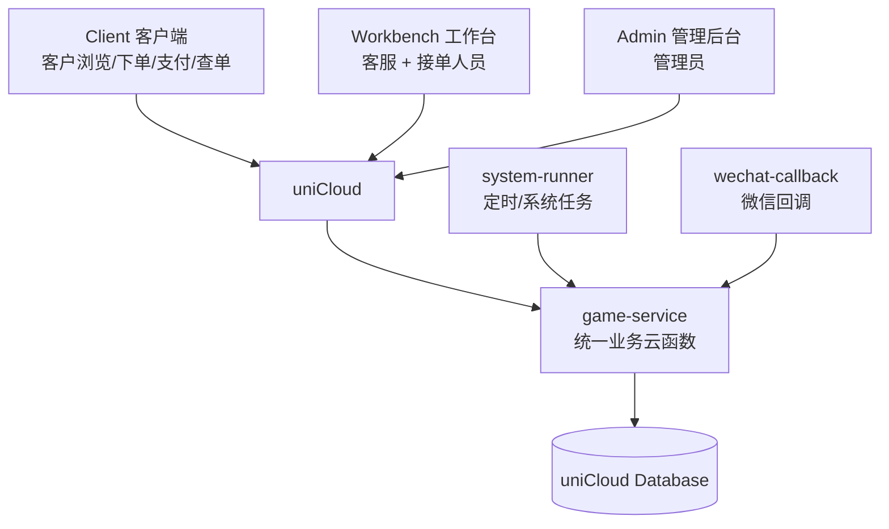
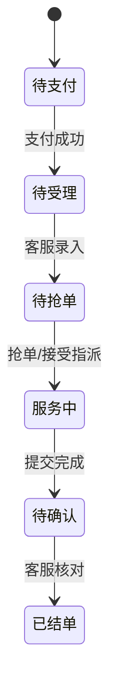
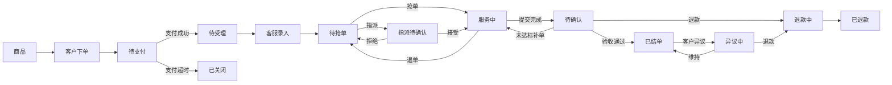

# 项目分析介绍文档

> 项目：星河服务平台  
> 文档目的：帮助开发、部署、测试和答辩人员快速理解“这个系统到底在做什么、三端如何协作、订单如何流转、数据如何变化、部署后怎么运行”。  
> 依据：当前项目代码结构、uniCloud 部署过程，以及《手动测试用例》中的 42 项验收场景。

---

# 1. 一句话理解这个项目

这个项目**不是一个单纯的商城系统**。

它本质上是一个：

> **“客户购买游戏服务 → 客服录入并调度 → 接单人员抢单/履约 → 客服验收 → 管理员审批退款/提现 → 平台结算与审计”**

的多角色服务交易与履约平台。

最简单地理解：

```text
客户负责：买服务、下单、支付、查订单
        ↓
客服负责：接收订单、补全信息、放入抢单池、处理售后
        ↓
接单人员：抢单、执行服务、提交完成结果
        ↓
客服负责：确认结果、结单
        ↓
管理员负责：管理账号、商品、配置、退款、提现、报表
```

因此项目真正的核心不是“商品展示”，而是：

- 订单状态机
- 多角色权限
- 服务任务调度
- 退款与佣金结算
- 钱包与提现
- 后台配置
- 审计与风控
- 多品牌配置

---

# 2. 项目解决的实际问题

传统人工服务交易常见问题包括：

- 客户通过聊天工具下单，订单信息分散；
- 客服人工登记订单，容易遗漏；
- 服务人员不知道哪些订单可以接；
- 多个人同时抢同一订单容易冲突；
- 服务完成后缺少统一验收；
- 客户退款、补单、异议处理依赖人工沟通；
- 服务人员佣金无法自动计算；
- 提现、调账、退款缺少操作记录；
- 管理员无法统一查看订单、资金、人员和经营数据。

本项目将流程统一到一个系统中：

```text
商品
 ↓
客户下单
 ↓
支付
 ↓
客服受理
 ↓
抢单/指派
 ↓
服务履约
 ↓
结果确认
 ↓
结单
 ↓
佣金入账
 ↓
提现 / 报表
```

---

# 3. 系统中有哪几类用户

| 用户类型 | 使用入口 | 核心职责 |
|---|---|---|
| 客户 | Client / H5 / 小程序 | 浏览商品、下单、支付、查单、发起异议 |
| 客服 | `/workbench/` | 录入订单、调度订单、处理售后、结单 |
| 接单人员 | `/workbench/` | 抢单、接受指派、履约、提交完成、提现 |
| 管理员 | `/admin/` | 员工、商品、配置、退款、提现、钱包、报表、品牌管理 |

测试用例要求管理员、客服、接单人员至少各有一个账号，客户通过客户入口使用系统。

---

# 4. 系统总体架构

## 4.1 大白话架构

```text
                    ┌─────────────────────┐
                    │       客户 Client    │
                    │ 浏览 / 下单 / 支付   │
                    └──────────┬──────────┘
                               │
                    ┌──────────▼──────────┐
                    │    uniCloud 云函数   │
                    │    game-service     │
                    └──────────┬──────────┘
                               │
               ┌───────────────┼───────────────┐
               │               │               │
       ┌───────▼──────┐ ┌──────▼──────┐ ┌────▼────────┐
       │ Workbench    │ │ Admin       │ │ uniCloud DB │
       │ 客服/接单端  │ │ 管理员后台  │ │ 业务数据    │
       └──────────────┘ └─────────────┘ └─────────────┘
```

## 4.2 Mermaid 架构图



---

# 5. 三个前端分别做什么

当前代码中有三个独立前端：

```text
apps/
├─ client/
├─ workbench/
└─ admin/
```

## 5.1 Client

面向最终客户，主要负责：

- 商品浏览
- 游戏分类
- 商品详情
- H5 下单
- 支付
- 支付结果
- 我的订单
- 订单查询
- 异议提交
- 订阅消息

可以理解为：

> Client = 客户购买服务的入口。

## 5.2 Workbench

Workbench 同时服务两种后台角色：客服和接单人员。

客服主要流程：

```text
支付完成订单
 ↓
客服录入服务信息
 ↓
进入抢单池
 ↓
抢单 / 指派
 ↓
服务人员履约
 ↓
客服核对
 ↓
结单 / 补单 / 退款 / 异议
```

接单人员主要流程：

```text
查看订单池
 ↓
抢单
 ↓
服务中
 ↓
提交完成结果
 ↓
等待客服确认
 ↓
结单
 ↓
佣金进入钱包
```

## 5.3 Admin

Admin 是最高管理端，主要负责：

- 员工管理
- 商品管理
- 字典管理
- 系统配置
- VIP 管理
- 钱包调账与冻结
- 退款审批
- 提现审批
- 经营报表
- 品牌配置

可以理解为：

> Admin 决定“系统允许怎么运行”，Workbench 决定“订单今天怎么处理”。

---

# 6. 后端为什么只有一个 game-service

三个前端生产环境最终都通过 uniCloud 调用：

```text
game-service
```

调用链：

```text
前端
 ↓
uniCloud.callFunction()
 ↓
game-service
 ↓
action
 ↓
对应 service
 ↓
Repository
 ↓
uniCloud Database
```

例如管理员登录：

```text
Admin 点击登录
 ↓
authLogin
 ↓
game-service
 ↓
认证模块
 ↓
users
 ↓
验证账号密码
 ↓
返回 session/token
```

因此 `game-service` 是整个项目的主要业务中枢。

---

# 7. system-runner 与 wechat-callback

## 7.1 system-runner

主要用于：

- 支付超时检查
- 指派超时处理
- 状态检查
- 系统定时任务
- 自动扫描待处理订单

例如：

```text
订单生成
 ↓
30 分钟仍未支付
 ↓
system-runner 定时检查
 ↓
调用 game-service
 ↓
订单关闭
```

## 7.2 wechat-callback

主要用于微信体系的服务器回调，包括：

- 微信服务通知
- 微信公众号/服务号回调
- 支付相关回调入口
- 微信事件处理

---

# 8. 数据库怎么理解

当前项目使用 uniCloud Database，并部署了约 42 个业务 Schema。

建议按业务领域理解。

## 8.1 用户与认证

```text
users
auth_sessions
login_events
account_security
mfa_recovery_codes
user_brand_roles
```

负责：

- 用户身份
- 用户角色
- 登录状态
- Session
- 登录安全
- MFA
- 品牌权限

## 8.2 商品与品牌

```text
products
brands
brand_config_versions
configs
dicts
```

负责：

- 商品
- 品牌
- 价格
- 游戏分类
- 服务档位
- 系统参数
- 品牌主题

## 8.3 订单

```text
orders
order_logs
order_messages
assignments
attachments
```

负责：

- 订单主体
- 状态变化
- 留言
- 抢单/指派
- 服务结果附件

## 8.4 支付退款

```text
payments
payment_events
refunds
```

支付和退款必须保留独立资金记录，不能只改订单状态。

## 8.5 钱包提现

```text
wallets
wallet_transactions
withdrawals
transfer_records
```

负责：

- 服务人员余额
- 佣金
- 冻结金额
- 调账
- 提现
- 打款记录

## 8.6 客服与运营

```text
customers
worker_profiles
vip_list
notifications
operational_events
operational_alerts
```

## 8.7 安全与审计

```text
audit_logs
privacy_audit_logs
privacy_consents
security_rate_limits
h5_token_revocations
system_nonces
data_rights_requests
```

负责记录：

- 谁做了什么
- 什么时间做的
- 修改前后数据
- 隐私操作
- Token 失效
- 限流
- 重放防护

这也是为什么登录和后台逻辑比普通 Demo 项目复杂。

---

# 9. 项目的核心：订单状态机

正常主流程：

```text
待支付
  ↓ 支付
待受理
  ↓ 客服录入
待抢单
  ↓ 服务人员抢单
服务中
  ↓ 服务人员完成
待确认
  ↓ 客服结单
已结单
```



这条链就是整个项目最重要的业务主线。

---

# 10. 异常订单怎么处理

## 10.1 支付超时

```text
待支付
 ↓
超时未支付
 ↓
已关闭
```

## 10.2 未开工取消

```text
待受理 / 待抢单
 ↓
客服申请取消
 ↓
管理员审批
 ↓
已取消
```

## 10.3 指派

```text
待抢单
 ↓
指派待确认
 ├─ 接受 → 服务中
 └─ 拒绝 → 待抢单
```

## 10.4 服务人员退单

```text
服务中
 ↓
退单
 ↓
待抢单
```

## 10.5 服务中退款

```text
服务中
 ↓
退款中
 ↓
已退款
```

同时处理：

```text
客户退款
+
服务人员佣金追回
```

## 10.6 补单

```text
待确认
 ↓
未达标
 ↓
补单
 ↓
服务中
 ↓
再次完成
 ↓
待确认
 ↓
已结单
```

## 10.7 异议

```text
已结单
 ↓
客户发起异议
 ↓
异议中
 ├─ 维持结单 → 已结单
 └─ 退款 → 退款中 → 已退款
```

---

# 11. 为什么需要客服

客服不是简单的聊天客服，而是：

> **订单运营调度中心**

工作流：

```text
客户付款
 ↓
订单进入待受理
 ↓
客服打开订单
 ↓
录入游戏、区服、服务类型、账号、昵称、期望时间、备注
 ↓
订单进入抢单池
 ↓
观察是否有人抢单
 ↓
必要时人工指派
 ↓
服务完成
 ↓
客服检查实际产出 + 截图
 ↓
客户确认
 ↓
结单
```

因此客服是客户和服务人员之间的“调度 + 验收 + 售后”中间层。

---

# 12. 抢单机制

客服完成订单录入后：

```text
订单
 ↓
进入抢单池
```

接单人员可以看到：

- 游戏
- 区服
- 服务类型
- 保底产出
- 金额
- 期望时间

并点击“抢单”。

系统必须保证：

```text
接单甲 ─┐
        ├─ 同时抢同一订单 → 只能一个成功
接单乙 ─┘
```

这属于典型的并发订单竞争问题。

测试用例中还要求限制接单人员同时进行中的订单数量。

---

# 13. 指派机制

如果订单长时间无人抢，客服可以主动指派：

```text
客服
 ↓
选择接单人员
 ↓
订单 = 指派待确认
 ↓
接单人员收到待办
```

接单人员可以：

```text
接受 → 服务中
拒绝 → 回抢单池
```

超时不处理也可以按业务规则视为拒绝。

---

# 14. 服务完成为什么不能直接结单

服务人员完成工作后，只能提交完成申请，并填写：

- 实际产出
- 完成凭证
- 截图

订单变为“待确认”。

然后客服核对。

原因是：

> 服务人员不能自己宣布“已经完成并获得佣金”。

必须形成：

```text
执行人
 ↓ 提交
客服
 ↓ 验收
系统
 ↓ 结算
```

---

# 15. 佣金和钱包怎么运行

订单结单后：

```text
订单金额
 ↓
根据商品抽成规则
 ↓
计算服务人员佣金
 ↓
写入 wallet_transactions
 ↓
更新 wallets
```

因此：

```text
订单结单
≠
直接给服务人员打钱
```

而是：

```text
结单
 ↓
钱包余额增加
 ↓
申请提现
 ↓
管理员审批
 ↓
实际打款
 ↓
标记已打款
```

---

# 16. 为什么退款还要“追佣”

如果订单已经结单并产生佣金，后续发生退款时：

```text
客户退款
+
服务人员佣金追回
```

必须同时发生，否则平台账务会失衡。

测试用例甚至允许因追佣导致钱包余额为负数。

---

# 17. 提现逻辑

服务人员申请提现前要检查：

```text
余额
 ↓
最低提现金额
 ↓
是否完成实名
 ↓
本周提现次数
 ↓
账号是否冻结
 ↓
提交提现
```

提现状态：

```text
可用余额
 ↓
申请提现
 ↓
冻结金额
 ↓
管理员审批
 ├─ 已打款 → 已提现
 └─ 驳回   → 解冻恢复余额
```

---

# 18. 管理员到底管理什么

管理员主要管理五类对象：

## 人
- 管理员
- 客服
- 接单人员
- 停用
- 实名审核
- 角色权限

## 商品
- 游戏
- 服务类型
- 档位
- 保底产出
- 价格
- 佣金比例
- 上下架

## 规则
- 支付时限
- 抢单池时限
- 同时接单上限
- 提现最低金额
- 周提现次数
- 补单次数

## 资金
- 退款
- 提现
- 钱包调账
- 钱包冻结

## 报表
- 订单流水
- 接单业绩
- 提现记录
- 利润分析
- 对账数据
- CSV 导出

---

# 19. 为什么支持多品牌

测试用例要求管理员可以新增品牌，并设置：

```text
AppID
Logo
主题色
文案
横幅
```

核心思想是：

> 品牌差异通过配置驱动，而不是复制代码。

即：

```text
同一套代码
 ↓
brands / configs
 ↓
品牌 A
品牌 B
品牌 C
```

这是一种多品牌/多租户思路。

---

# 20. 登录为什么看起来复杂

原设计登录不只是账号密码，还包含：

- 密码 Hash
- 登录失败次数
- 临时锁定
- Session
- Token
- 角色校验
- MFA
- PII 数据保护
- IP / Device 安全信息
- 审计日志

因此部署过程中出现过：

```text
UNAUTHORIZED
PII_KEY_MISSING
登录失败锁定
```

这些属于认证安全层，不是简单前端页面错误。

联调阶段可以采用简化模式，仅保留：

```text
手机号
 ↓
密码 Hash 校验
 ↓
ADMIN 角色校验
 ↓
Session / Token
 ↓
登录成功
```

正式生产再恢复完整安全策略。

---

# 21. PII 是什么

PII：

> Personally Identifiable Information，个人可识别信息。

例如：

- 手机号
- 姓名
- 微信号
- 身份信息

项目对这类数据做加密保护，因此云函数需要相关加密配置。

这也是为什么不能随意直接向 `users` 集合插入明文账号密码。

---

# 22. 本地与生产请求链路

本地开发：

```text
Client / Admin / Workbench
 ↓
HTTP
 ↓
127.0.0.1:4176
 ↓
本地 api-server
```

生产：

```text
Client / Admin / Workbench
 ↓
uniCloud.callFunction()
 ↓
game-service
 ↓
uniCloud Database
```

因此当前开发方式可以理解为：

> Local-First + Production uniCloud

---

# 23. 为什么生产要用 HBuilderX 发行

三个前端是 uni-app CLI 项目。

普通 `npm run build` 可以生成静态资源，但生产 H5 使用 `uniCloud.callFunction()` 时，还需要 HBuilderX 将：

```text
AppID
+
uniCloud 服务空间
```

正确绑定到生产构建中。

否则会出现：

```text
uni-app cli项目内使用uniCloud需要使用HBuilderX的运行菜单运行项目，
且需要在uniCloud目录关联服务空间
```

正确生产流程：

```text
项目
 ↓
HBuilderX
 ↓
关联 pwfinal
 ↓
Web发行
 ↓
dist/build/web
 ↓
前端网页托管
```

---

# 24. 当前生产部署结构

uniCloud 阿里云服务空间：

```text
pwfinal
```

主要云函数：

```text
game-service
system-runner
wechat-callback
```

前端规划：

```text
https://h5.qmhyjoy.com/
→ Client

https://h5.qmhyjoy.com/workbench/
→ Workbench

https://h5.qmhyjoy.com/admin/
→ Admin
```

三个业务前端共享：

```text
同一个域名
+
不同路径
+
同一个 uniCloud 服务空间
+
同一套数据库
```

---

# 25. 为什么 `?v=xxx` 能解决旧版报错

例如：

```text
/admin/#/
```

可能命中旧 CDN / 浏览器缓存。

而：

```text
/admin/?v=2026090921#/
```

URL 发生变化后，浏览器/CDN 会重新请求新版本。

因此部署后要注意：

```text
上传新文件
 ↓
刷新 CDN
 ↓
Ctrl + F5
 ↓
再验证
```

---

# 26. 为什么需要 bootstrap-seed

上传 Schema 只创建数据库结构，并不会自动创建：

```text
管理员
品牌
配置
商品
```

本地测试中的：

```text
seedAdmin()
fixture()
seedDb()
```

主要用于测试环境 / Memory DB / 本地演示。

因此生产云端需要一次性初始化：

```text
bootstrap-seed
 ↓
创建默认品牌
 ↓
创建基础配置
 ↓
创建管理员
 ↓
绑定管理员品牌角色
```

初始化成功后应移除一次性 bootstrap 云函数。

---

# 27. 项目完整业务主链

只记一个流程，就记下面这一条：

```text
【管理员】
配置品牌、商品、员工、业务规则
             ↓
【客户】
浏览商品
             ↓
下单
             ↓
支付
             ↓
订单 = 待受理
             ↓
【客服】
补充客户服务资料
             ↓
订单 = 待抢单
             ↓
【接单人员】
抢单 / 接受指派
             ↓
订单 = 服务中
             ↓
完成服务 + 上传结果
             ↓
订单 = 待确认
             ↓
【客服】
核对服务结果
             ↓
结单
             ↓
【系统】
计算佣金
             ↓
接单人员钱包余额增加
             ↓
【接单人员】
申请提现
             ↓
【管理员】
审核 + 打款
             ↓
业务闭环
```

---

# 28. 完整订单心智模型



---

# 29. 42 项测试用例到底在验证什么

可以分成 6 大类：

| 分类 | 测试重点 |
|---|---|
| 客户下单与支付 | 商品、下单、支付、查询、异议 |
| 客服操作 | 订单受理、录入、抢单池、指派、结单、退款 |
| 接单操作 | 抢单、退单、指派、完成、钱包、提现 |
| 管理员操作 | 员工、商品、配置、VIP、钱包、审批、报表、品牌 |
| 订单状态路径 | 正常路径和多类异常路径 |
| 通用检查 | 文案、入口隔离、浏览器兼容 |

所以测试用例不是零散页面测试，而是在验证：

> 整个服务交易业务闭环是否成立。

---

# 30. 文案红线

测试用例要求检查小程序、工作台和管理后台全部页面文案，包括：

- 商品名
- 订单备注
- 消息文案

也就是说：

```text
技术功能正确
≠
项目可以上线
```

还需要满足运营合规要求。

---

# 31. 多入口与权限隔离

系统有三个入口：

```text
/
→ 客户

/workbench/
→ 客服 / 接单

/admin/
→ 管理员
```

真正的权限安全不能只靠“隐藏页面”。

必须同时做到：

```text
前端入口隔离
+
game-service 后端角色鉴权
```

例如客服账号即使知道 `/admin/` 地址，也不能因此获得管理员权限。

---

# 32. 项目能力边界

本项目适合解决：

- 服务型商品交易
- 多角色订单协作
- 抢单
- 指派
- 履约
- 结算
- 钱包
- 退款
- 提现
- 品牌配置
- 后台运营

但它本身不等于：

- 微信支付平台
- 银行清结算系统
- 实名认证服务商
- 短信服务商
- 微信消息基础设施

这些能力需要依赖第三方平台。

---

# 33. 为什么项目看起来很复杂

因为它实际上同时包含：

```text
商城
+
订单系统
+
任务派单系统
+
客服系统
+
员工管理
+
资金系统
+
退款系统
+
钱包系统
+
审批系统
+
报表系统
+
品牌系统
+
安全系统
```

因此更准确地说：

> **这是一个围绕订单状态机组织起来的多角色服务履约平台。**

---

# 34. 初学者理解项目的最佳顺序

不要一开始阅读所有代码。

建议：

```text
第一步：角色
客户 / 客服 / 接单 / 管理员

第二步：正常订单路径
待支付 → 待受理 → 待抢单 → 服务中 → 待确认 → 已结单

第三步：三个前端
Client / Workbench / Admin

第四步：后端
action → service → repository → database

第五步：异常订单
取消 / 退款 / 补单 / 异议 / 退单 / 指派

第六步：高级模块
钱包 / 提现 / 审计 / PII / MFA / 多品牌 / 支付回调 / 定时任务
```

---

# 35. 5 分钟项目介绍话术

> 星河服务平台是一个面向游戏服务交易场景的多角色服务订单管理平台。系统包含客户端、客服/接单工作台以及管理员后台三个前端入口，后端统一通过 uniCloud 的 game-service 云函数处理业务，并使用 uniCloud Database 保存订单、用户、商品、支付、退款、钱包和审计等数据。
>
> 客户首先在 Client 浏览商品并下单支付。支付完成后订单进入客服工作台，客服补充服务信息后将订单放入抢单池。接单人员可以主动抢单，也可以由客服指派。接单成功后订单进入服务中，接单人员完成服务并上传实际产出及截图，客服核对后完成结单。
>
> 结单以后，系统根据商品配置计算接单人员佣金并写入钱包。接单人员可以申请提现，由管理员审核并完成打款。如果订单没有达到保底要求，还可以进入补单、部分退款或全额退款流程；如果客户对已结单订单存在异议，则进入异议仲裁流程。
>
> 管理员后台主要负责员工、商品、字典、系统参数、VIP、钱包、退款、提现、报表和品牌配置。项目采用配置驱动设计，例如支付时限、最大同时接单数、最低提现金额等都可以通过后台配置调整。
>
> 整个系统最核心的技术和业务设计是订单状态机、多角色权限、任务抢单并发、资金结算以及操作审计。

---

# 36. 当前部署阶段

截至当前联调阶段：

```text
Client
 ↓
已完成生产发行与访问验证

Admin
 ↓
已完成 HBuilderX Web 发行
 ↓
已能调用 uniCloud / game-service
 ↓
正在完善生产认证、初始化数据和安全策略

Workbench
 ↓
后续按同样方式完成发行与业务验证
```

当前重点已经从：

```text
“页面能不能打开”
```

进入：

```text
“生产数据库、账号、权限、配置、业务状态能否完整运行”
```

---

# 37. 后续最推荐的验证顺序

不要一开始同时跑 42 个用例。

先跑一条最小闭环：

```text
1. Admin 登录
2. 创建客服
3. 创建接单人员
4. 创建并上架一个商品
5. Client 看见商品
6. Client 下单
7. mock/测试支付成功
8. 客服录入
9. 接单人员抢单
10. 接单人员提交完成
11. 客服结单
12. 检查钱包
13. 提现
14. Admin 审批
```

只要这一条跑通，就说明：

```text
用户
商品
订单
权限
抢单
履约
钱包
审批
```

这些核心模块已经串起来。

之后再逐步测试：

```text
取消
退款
补单
异议
VIP
品牌
报表
真实支付
```

---

# 38. 最终总结

这个项目可以用四句话总结：

> **第一，它是一个服务订单平台，而不是普通商城。**  
> **第二，它围绕订单状态机运行。**  
> **第三，Client、Workbench、Admin 三个前端负责不同角色。**  
> **第四，uniCloud 的 game-service 是业务中枢，数据库保存订单、人员、资金、配置和审计数据。**

最核心的一条链：

```text
客户购买
→ 客服调度
→ 接单履约
→ 客服验收
→ 平台结算
→ 管理员监管
```

理解这条链以后，再去看具体代码、数据库和测试用例，就会容易很多。
